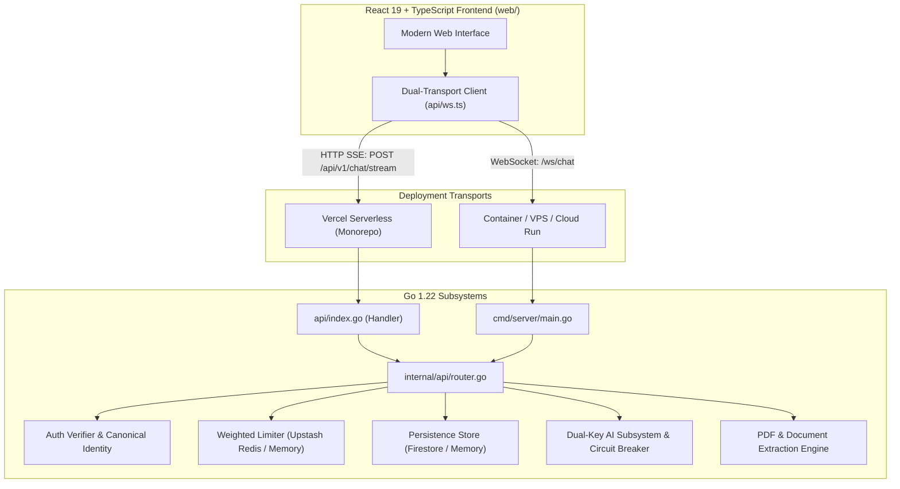

# Counsel — AI-Powered Legal Understanding & Preparation Assistant

> **"Understand the law. Know your next step."**

[](https://golang.org)
[](https://react.dev)
[](https://www.typescriptlang.org)
[](https://vercel.com)
[](LICENSE)

Counsel transforms complex, intimidating legal contracts, clauses, and disputes into clear, structured, plain-English guidance. Purpose-built for individuals and small businesses facing legal ambiguity, Counsel bridges the gap between confusing legal jargon and actionable preparation without pretending to replace a qualified lawyer.

---

## 🏛️ Core Product Principles & Ethical Boundaries

Counsel is an **AI-powered legal understanding and preparation assistant**. 

Counsel is **NOT**:
* A law firm, lawyer, or legal representative
* A court, magistrate, or legal authority
* A source of guaranteed legal outcomes
* A tool to evade law enforcement or conceal wrongdoing

### The 4 Pillars of Distinction
Counsel strictly and transparently separates guidance into 4 clear categories:
1. **Plain-English Information**: *"What this clause appears to mean in everyday language."*
2. **Risk Interpretation**: *"This clause may create an obligation or liability worth reviewing."*
3. **Jurisdictional Possibility**: *"Depending on your jurisdiction and factual situation, this could potentially..."*
4. **Professional Advice**: *"A licensed lawyer should verify whether this provision is enforceable in your jurisdiction."*

---

## ⚡ Key Features

* **8 Specialized Legal Modes**:
  * **Contract**: Analyzes parties, obligations, compensation, duration, termination mechanics, and restrictive covenants.
  * **Criminal**: Clarifies procedural rights, bail concepts, and factual chronologies while strictly rejecting evasion assistance.
  * **Civil**: Identifies breach of contract, damages, evidence checklists, and upcoming statutes of limitation.
  * **Clause Deep-Dive**: Exhaustive clause breakdown: Plain-English meaning, who is affected, what it requires/permits, traps, and questions.
  * **Document Review**: Full-spectrum audit with an attention matrix (High attention, Worth reviewing, Informational).
  * **Agreement Comparison**: Side-by-side variance analysis highlighting executive differences, new burdens, and removed protections.
  * **Prepare for a Lawyer**: Converts messy situations into professional lawyer briefings (Situation, Verified Facts, Timeline, Questions, Evidence Checklist).
  * **General**: Automatically categorizes legal situations and recommends structured next steps.
* **Grounded Clause Citations**: Anchors AI answers directly to specific document clauses and page numbers (e.g., `[Source: Page 3, Section 7.2]`).
* **Multi-Jurisdiction Context Engine**: Tailors guidance to legal frameworks in **India** (Indian Contract Act 1872, BNSS, Consumer Protection Act), **United States** (at-will employment, UCC), **United Kingdom** (common law, statutory employment rights), **European Union** (civil law, GDPR), and **General**.
* **Dual-Key OpenRouter AI Gateway**:
  * **Google Normal / Fast**: `google/gemma-4-26b-a4b-it:free` (262k context window)
  * **Google Thinking**: `google/gemma-4-31b-it:free` (262k context window)
  * **NVIDIA Normal / Fast**: `nvidia/nemotron-3-super-120b-a12b:free` (262k context window)
  * **NVIDIA Thinking / Expert**: `nvidia/nemotron-3-ultra-550b-a55b:free` (1M context window)
  * **Circuit Breaker**: Automatic failover between primary and secondary OpenRouter keys with automated cooldown periods.
  * **Reasoning Suppression**: Private chain-of-thought tokens are filtered and mapped to user-friendly status states (*"Reviewing relevant clauses..."*).
* **Weighted Quotas & Rate Limiting**: Capacity accounting (normal text 1x, thinking 2x, expert 3x, document pages weighted) backed by **Upstash Redis** and thread-safe in-memory fallback.
* **Canonical Identity & Dual Auth**: Resolves Google (Firebase) and Email (Supabase) accounts into a unified canonical Counsel user ID, covering all 9 duplicate-account edge cases (Cases A through I). Includes an instant **1-Click Demo Account** for rapid evaluation.
* **Document Intelligence Engine**: Pure Go PDF and text parser extracting clean text, page counts, and section headings while strictly isolating document text inside `<untrusted_document>` security barriers against prompt injection.

---

## 🏗️ Architecture & Dual-Transport

Counsel is architected as a **unified monorepo** with a **dual-transport design**:



### Transport Comparison
* **Vercel Serverless Deployment**: The browser client automatically streams AI completions using HTTP Server-Sent Events (SSE) via `POST /api/v1/chat/stream`. Serverless functions terminate cleanly when complete.
* **Container / VPS Deployment**: The browser client automatically connects via persistent WebSockets (`/ws/chat`) for continuous bidirectional state.

The frontend client automatically detects the environment and switches seamlessly with zero UI changes.

---

## 📁 Repository Structure

```text
counsel/
├── api/                        # Vercel Serverless entrypoints
│   ├── index.go                # Vercel Go Serverless Function Handler
│   └── index_test.go           # Tests for Vercel Serverless Handler
├── cmd/
│   └── server/                 # Standalone / Docker server entrypoint
│       ├── main.go             # Native HTTP & WebSocket server
│       └── main_test.go        # Server lifecycle tests
├── internal/                   # Private core packages
│   ├── ai/                     # OpenRouter client, circuit breaker, prompts, registry
│   ├── api/                    # REST routes, SSE chat streaming handler, middleware
│   ├── auth/                   # Canonical identity manager, Firebase & Supabase verifiers
│   ├── config/                 # Environment configuration loader
│   ├── documents/              # PDF & plain text parser, injection sanitizer
│   ├── logger/                 # Structured JSON logger with secret redaction
│   ├── models/                 # Shared data models and type definitions
│   ├── ratelimit/              # Upstash Redis & in-memory weighted rate limiter
│   ├── store/                  # Store interface, Firestore & in-memory store
│   └── websocket/              # Gorilla WebSocket hub, client, and protocol
├── web/                        # React 19 + TypeScript frontend
│   ├── src/
│   │   ├── api/                # API client (REST + dual-transport ws.ts)
│   │   ├── auth/               # Auth modal, context, demo personas
│   │   ├── components/         # UI components (Composer, Messages, Sidebar, Modals)
│   │   ├── types/              # TypeScript interfaces and envelope definitions
│   │   └── __tests__/          # Vitest test suite (UI, Auth, PDF, SSE streaming)
│   ├── package.json            # Frontend scripts and dependencies
│   └── vite.config.ts          # Vite build and proxy configuration
├── .env.example                # Template for environment variables
├── .gitignore                  # Production exclusion rules
├── go.mod                      # Go module definition
├── package.json                # Monorepo root convenience scripts
└── vercel.json                 # Vercel unified monorepo configuration
```

---

## ☁️ Deployment Guide

### Option 1: Vercel Serverless Monorepo (Recommended)

Counsel is pre-configured to deploy frontend and backend **together in a single Vercel project**.

#### 1. Push to Git
Push your repository to GitHub, GitLab, or Bitbucket.

#### 2. Import into Vercel
1. Visit [vercel.com/new](https://vercel.com/new) and import your repository.
2. Leave the **Root Directory** as `./` (the root).
3. The root [`vercel.json`](file:///d:/counsel/vercel.json) automatically instructs Vercel to:
   * Build the frontend: `cd web && npm install && npm run build` into `web/dist`.
   * Compile the Go serverless function: [`api/index.go`](file:///d:/counsel/api/index.go).
   * Route `/api/*` to the Go function and `/((?!api/).*)` to the Vite SPA.

#### 3. Configure Environment Variables
Under **Project Settings → Environment Variables**, add:

| Variable | Description | Required? | Example / Default |
| :--- | :--- | :---: | :--- |
| `OPENROUTER_API_KEY_PRIMARY` | Primary OpenRouter API key | **Yes** | `sk-or-v1-...` |
| `OPENROUTER_API_KEY_SECONDARY` | Secondary OpenRouter key (circuit breaker fallback) | Optional | `sk-or-v1-...` |
| `UPSTASH_REDIS_REST_URL` | Upstash Redis REST URL for distributed rate limits | Optional | `https://...upstash.io` |
| `UPSTASH_REDIS_REST_TOKEN` | Upstash Redis REST Token | Optional | `AX...` |
| `FIREBASE_PROJECT_ID` | Firebase Project ID for Google sign-in | Optional | `my-counsel-project` |
| `SUPABASE_URL` | Supabase URL for email/password auth | Optional | `https://...supabase.co` |
| `SUPABASE_JWT_SECRET` | Supabase JWT Secret for token verification | Optional | `your-jwt-secret` |

#### 4. Deploy via CLI (Alternative)
```bash
npm i -g vercel
vercel deploy --prod
```

---

### Option 2: Standalone Container / Cloud Run / VPS

If you prefer long-lived persistent WebSockets (`/ws/chat`), run Counsel as a container on Google Cloud Run, Railway, Render, or a VPS:

```bash
# Build Go binary
go build -o server ./cmd/server

# Build Frontend
cd web && npm install && npm run build && cd ..

# Run standalone server
PORT=8080 ./server
```

---

## 💻 Local Development Setup

### Prerequisites
* **Go**: 1.22 or later
* **Node.js**: 18 or later, with npm

### 1. Clone & Configure Environment
```bash
git clone https://github.com/your-org/counsel.git
cd counsel
cp .env.example .env
```
*(If `.env` keys are left blank, Counsel will seamlessly operate in demo mode).*

### 2. Run Backend
In your first terminal:
```bash
go run ./cmd/server
```
The server will start at `http://127.0.0.1:8080`.

### 3. Run Frontend
In a second terminal:
```bash
cd web
npm install
npm run dev
```
Open `http://localhost:5173` in your browser.

*(Alternatively, use root scripts: `npm run dev`, `npm run build`, `npm run test`).*

---

## 🧪 Testing & Verification

Counsel includes end-to-end and unit test suites across all backend packages and frontend components.

### Backend Go Tests
```bash
# Run all unit tests across all packages
go test -count=1 -short ./...

# Run tests with verbose output for specific subsystems
go test -v ./internal/api
go test -v ./internal/ai
go test -v ./internal/ratelimit
go test -v ./api
```

### Frontend Tests & Type Checking
```bash
# Run all Vitest frontend unit tests (22 tests)
npm run test

# Run TypeScript compilation and production build
npm run build
```

---

## 🔒 Security Standards & Threat Mitigation

* **Strict Tenant Data Isolation**: All database and storage operations strictly scope queries to the authenticated `userId`. User A cannot view, mutate, or delete conversations or documents belonging to User B.
* **Zero Secret Leakage**: OpenRouter API keys, database credentials, and service tokens are kept exclusively in server-side memory and are never exposed to browser bundles, network envelopes, or logs.
* **OWASP Security Headers**: All HTTP responses include `X-Content-Type-Options: nosniff`, `X-Frame-Options: DENY`, `X-XSS-Protection: 1; mode=block`, and `Referrer-Policy: strict-origin-when-cross-origin`.
* **Prompt Injection Defense**: User documents are strictly wrapped in `<untrusted_document>` security barriers with explicit system instructions prohibiting obedience to instructions found inside documents.
* **Weighted Rate Limiting**: Protects AI resources from abuse using capacity accounting (thinking queries consume 2 units, expert queries consume 3 units) backed by Upstash Redis.
* **Safe Log Redaction**: Structured JSON logging automatically sanitizes and redacts Bearer tokens, passwords, authorization headers, and API keys.

---

## ⚖️ Legal Disclaimer

**Counsel provides automated legal document understanding and preparation assistance. It is NOT legal advice, legal representation, or a substitute for a licensed attorney.**

Laws and precedents vary significantly by jurisdiction and change frequently. No attorney-client relationship is formed through the use of Counsel. For critical legal matters, active disputes, criminal proceedings, or contractual execution, always consult a licensed attorney in the appropriate jurisdiction.
